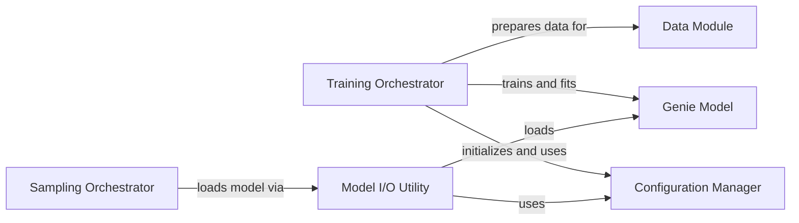

## Component Details

This subsystem manages the high-level execution flows for both training and sampling processes within the Genie project. It orchestrates the loading of configurations, instantiation of models, preparation of data, and the main operational loops for training and sampling. The core purpose is to provide a structured and controlled environment for running the protein structure generation tasks, ensuring proper setup, execution, and resource management for both model training and subsequent structure generation.

### Training Orchestrator
This component is responsible for orchestrating the training process of the Genie model. It initializes the configuration, sets up logging, defines checkpointing, prepares the data module, instantiates the Genie model, and finally runs the training loop using a PyTorch Lightning Trainer.

**Related Classes/Methods**:

- <a href="https://github.com/aqlaboratory/genie/blob/master/genie/train.py#L11-L55" target="_blank" rel="noopener noreferrer">`genie.genie.train.main` (11:55)</a>

### Sampling Orchestrator
This component handles the sampling process from a trained Genie model. It loads a pre-trained model, sets up the output directory for samples, and then iteratively generates protein structures based on specified lengths and batch sizes, saving the coordinates to files.

**Related Classes/Methods**:

- <a href="https://github.com/aqlaboratory/genie/blob/master/genie/sample.py#L10-L47" target="_blank" rel="noopener noreferrer">`genie.genie.sample.main` (10:47)</a>

### Configuration Manager
This component is responsible for loading and managing the application's configuration settings from a specified file. It provides a structured way to access various parameters required for training and other operations.

**Related Classes/Methods**:

- <a href="https://github.com/aqlaboratory/genie/blob/master/genie/config.py#L7-L92" target="_blank" rel="noopener noreferrer">`genie.config.Config` (7:92)</a>

### Data Module
This component encapsulates the data loading and preprocessing logic for the SCOPe dataset. It prepares the data for training and validation, handling aspects like batching and data transformations, making it ready for consumption by the model.

**Related Classes/Methods**:

- <a href="https://github.com/aqlaboratory/genie/blob/master/genie/data/data_module.py#L9-L42" target="_blank" rel="noopener noreferrer">`genie.data.data_module.SCOPeDataModule` (9:42)</a>

### Genie Model
This component represents the core Genie diffusion model architecture. It is responsible for the forward and reverse diffusion processes, enabling the generation of protein structures. It interacts with the configuration to set up its internal parameters.

**Related Classes/Methods**:

- <a href="https://github.com/aqlaboratory/genie/blob/master/genie/diffusion/genie.py#L9-L109" target="_blank" rel="noopener noreferrer">`genie.diffusion.genie.Genie` (9:109)</a>

### Model I/O Utility
This utility component provides functionality for loading pre-trained models from specified directories and versions. It abstracts the details of model deserialization, making it easy for other parts of the system to retrieve trained models.

**Related Classes/Methods**:

- <a href="https://github.com/aqlaboratory/genie/blob/master/genie/utils/model_io.py#L23-L65" target="_blank" rel="noopener noreferrer">`genie.utils.model_io.load_model` (23:65)</a>

### [FAQ](https://github.com/CodeBoarding/GeneratedOnBoardings/tree/main?tab=readme-ov-file#faq)