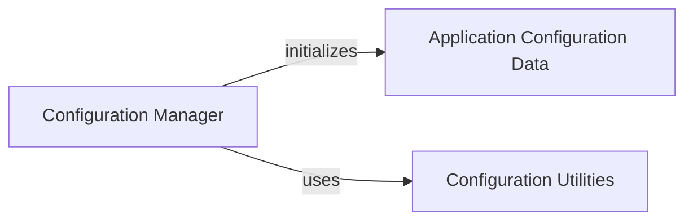

## Component Details

The Configuration Manager subsystem is responsible for centralizing the application's configuration handling. It loads configuration parameters from a specified file or initializes with default settings, then parses and structures this raw data into accessible, type-converted attributes. This structured configuration, categorized into sections like I/O, diffusion, model, training, and optimization, is then made available for various application modules to consume, ensuring consistent and validated application-wide settings.

### Configuration Manager
The core component responsible for loading, parsing, and structuring application-wide configuration parameters. It reads raw configuration data and transforms it into strongly-typed attributes for different application modules.

**Related Classes/Methods**:

- <a href="https://github.com/aqlaboratory/genie/blob/master/genie/config.py#L7-L92" target="_blank" rel="noopener noreferrer">`genie.genie.config.Config` (7:92)</a>
- <a href="https://github.com/aqlaboratory/genie/blob/master/genie/config.py#L9-L11" target="_blank" rel="noopener noreferrer">`genie.genie.config.Config.__init__` (9:11)</a>
- <a href="https://github.com/aqlaboratory/genie/blob/master/genie/config.py#L80-L92" target="_blank" rel="noopener noreferrer">`genie.genie.config.Config._load_config` (80:92)</a>
- <a href="https://github.com/aqlaboratory/genie/blob/master/genie/config.py#L13-L78" target="_blank" rel="noopener noreferrer">`genie.genie.config.Config._create_config` (13:78)</a>

### Application Configuration Data
Represents the structured and type-converted configuration parameters used throughout the application. This data is organized into distinct sections such as I/O, diffusion, model, training, and optimization, and is managed by the Configuration Manager.

**Related Classes/Methods**:

- <a href="https://github.com/aqlaboratory/genie/blob/master/genie/config.py#L7-L92" target="_blank" rel="noopener noreferrer">`genie.genie.config.Config` (7:92)</a>

### Configuration Utilities
Provides helper functions for parsing and converting raw configuration values into appropriate data types, such as handling optional integers or lists of strings. These utilities ensure data integrity and type correctness during the configuration processing.

**Related Classes/Methods**:

- <a href="https://github.com/aqlaboratory/genie/blob/master/genie/config.py#L1-L3" target="_blank" rel="noopener noreferrer">`genie.genie.config.int_or_none` (1:3)</a>
- <a href="https://github.com/aqlaboratory/genie/blob/master/genie/config.py#L5-L7" target="_blank" rel="noopener noreferrer">`genie.genie.config.str_list_or_none` (5:7)</a>

### [FAQ](https://github.com/CodeBoarding/GeneratedOnBoardings/tree/main?tab=readme-ov-file#faq)