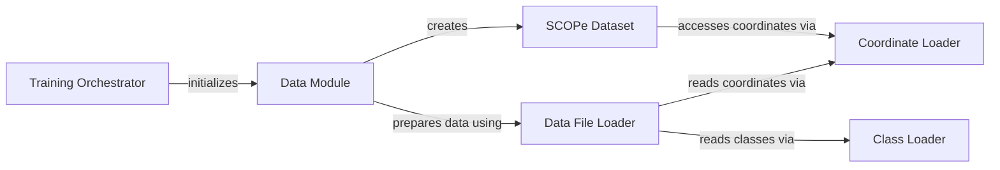

## Component Details

This subsystem, primarily focused on Data Management, handles the entire lifecycle of protein structure datasets, from loading and preprocessing to batching for training and evaluation. It encompasses components for orchestrating data flow, managing dataset instances, and providing low-level utilities for file I/O of coordinates and class labels. The main flow involves the Data Module preparing data using various loaders, which is then consumed by the SCOPe Dataset for training.

### Training Orchestrator
This component, represented by the `main` function in `genie.genie.train`, is responsible for setting up and orchestrating the entire training process. It handles configuration loading, device setup, logger initialization (TensorBoard and WandB), checkpointing, seeding, and ultimately initiates the training loop by fitting the model to the data module.

**Related Classes/Methods**:

- <a href="https://github.com/aqlaboratory/genie/blob/master/genie/train.py#L11-L55" target="_blank" rel="noopener noreferrer">`genie.genie.train.main` (11:55)</a>

### Data Module
The `SCOPeDataModule` acts as a central component for managing data loading and preparation for the training process. It encapsulates the logic for setting up the dataset, including loading file paths and creating the `SCOPeDataset` instance, and provides data loaders for training and validation.

**Related Classes/Methods**:

- <a href="https://github.com/aqlaboratory/genie/blob/master/genie/data/data_module.py#L9-L42" target="_blank" rel="noopener noreferrer">`genie.genie.data.data_module.SCOPeDataModule` (9:42)</a>
- <a href="https://github.com/aqlaboratory/genie/blob/master/genie/data/data_module.py#L24-L39" target="_blank" rel="noopener noreferrer">`genie.genie.data.data_module.SCOPeDataModule.setup` (24:39)</a>

### SCOPe Dataset
The `SCOPeDataset` class represents the actual dataset used for training and evaluation. It manages the collection of file paths and provides a mechanism to retrieve individual data samples (coordinates and masks) based on an index, handling any necessary padding or cropping of the data.

**Related Classes/Methods**:

- <a href="https://github.com/aqlaboratory/genie/blob/master/genie/data/dataset.py#L6-L31" target="_blank" rel="noopener noreferrer">`genie.genie.data.dataset.SCOPeDataset` (6:31)</a>
- <a href="https://github.com/aqlaboratory/genie/blob/master/genie/data/dataset.py#L18-L31" target="_blank" rel="noopener noreferrer">`genie.genie.data.dataset.SCOPeDataset.__getitem__` (18:31)</a>

### Data File Loader
This utility component, `load_filepaths` in `genie.genie.utils.data_io`, is responsible for discovering and filtering data file paths based on various criteria such as dataset names, residue counts, and class labels. It interacts with other data loading utilities to ensure only relevant data files are processed.

**Related Classes/Methods**:

- <a href="https://github.com/aqlaboratory/genie/blob/master/genie/utils/data_io.py#L17-L80" target="_blank" rel="noopener noreferrer">`genie.genie.utils.data_io.load_filepaths` (17:80)</a>

### Coordinate Loader
The `load_coord` function within `genie.genie.utils.data_io` is a specialized utility for reading coordinate data from a given file path. It serves as a low-level data access component, providing numerical coordinate arrays to higher-level data processing components.

**Related Classes/Methods**:

- <a href="https://github.com/aqlaboratory/genie/blob/master/genie/utils/data_io.py#L6-L7" target="_blank" rel="noopener noreferrer">`genie.genie.utils.data_io.load_coord` (6:7)</a>

### Class Loader
The `load_classes` function in `genie.genie.utils.data_io` is responsible for parsing and loading class information from a specified file. It provides a mapping of domain names to their respective class labels, which is used during data filtering and organization.

**Related Classes/Methods**:

- <a href="https://github.com/aqlaboratory/genie/blob/master/genie/utils/data_io.py#L9-L15" target="_blank" rel="noopener noreferrer">`genie.genie.utils.data_io.load_classes` (9:15)</a>

### [FAQ](https://github.com/CodeBoarding/GeneratedOnBoardings/tree/main?tab=readme-ov-file#faq)