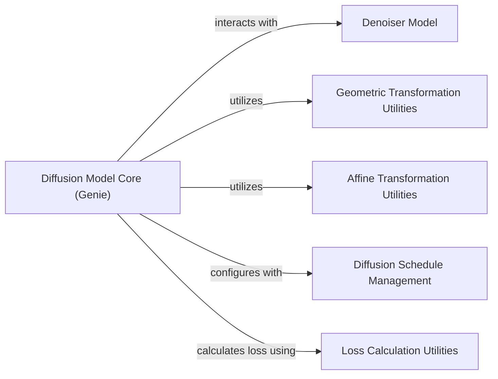

## Component Details

This graph illustrates the core components and their interactions within the Diffusion Model Core (Genie) subsystem. The central purpose of this subsystem is to implement the diffusion process for protein generation, encompassing noise scheduling, forward and reverse diffusion steps, sampling, and training. It relies on a Denoiser Model for noise prediction and various utility components for geometric transformations, affine transformations, diffusion schedule management, and loss calculation.

### Diffusion Model Core (Genie)
Implements the core diffusion process for protein generation, including noise scheduling, forward and reverse diffusion steps, sampling, training, and loss calculation. It orchestrates the interaction with the Protein Denoiser Network.

**Related Classes/Methods**:

- <a href="https://github.com/aqlaboratory/genie/blob/master/genie/diffusion/genie.py#L9-L109" target="_blank" rel="noopener noreferrer">`genie.genie.diffusion.genie.Genie` (9:109)</a>
- <a href="https://github.com/aqlaboratory/genie/blob/master/genie/diffusion/genie.py#L11-L30" target="_blank" rel="noopener noreferrer">`genie.genie.diffusion.genie.Genie.setup_schedule` (11:30)</a>
- <a href="https://github.com/aqlaboratory/genie/blob/master/genie/diffusion/genie.py#L32-L42" target="_blank" rel="noopener noreferrer">`genie.genie.diffusion.genie.Genie.transform` (32:42)</a>
- <a href="https://github.com/aqlaboratory/genie/blob/master/genie/diffusion/genie.py#L44-L45" target="_blank" rel="noopener noreferrer">`genie.genie.diffusion.genie.Genie.sample_timesteps` (44:45)</a>
- <a href="https://github.com/aqlaboratory/genie/blob/master/genie/diffusion/genie.py#L47-L51" target="_blank" rel="noopener noreferrer">`genie.genie.diffusion.genie.Genie.sample_frames` (47:51)</a>
- <a href="https://github.com/aqlaboratory/genie/blob/master/genie/diffusion/genie.py#L53-L63" target="_blank" rel="noopener noreferrer">`genie.genie.diffusion.genie.Genie.q` (53:63)</a>
- <a href="https://github.com/aqlaboratory/genie/blob/master/genie/diffusion/genie.py#L65-L97" target="_blank" rel="noopener noreferrer">`genie.genie.diffusion.genie.Genie.p` (65:97)</a>
- <a href="https://github.com/aqlaboratory/genie/blob/master/genie/diffusion/genie.py#L99-L109" target="_blank" rel="noopener noreferrer">`genie.genie.diffusion.genie.Genie.loss_fn` (99:109)</a>
- <a href="https://github.com/aqlaboratory/genie/blob/master/genie/diffusion/diffusion.py#L9-L99" target="_blank" rel="noopener noreferrer">`genie.genie.diffusion.diffusion.Diffusion` (9:99)</a>
- <a href="https://github.com/aqlaboratory/genie/blob/master/genie/diffusion/diffusion.py#L11-L21" target="_blank" rel="noopener noreferrer">`genie.genie.diffusion.diffusion.Diffusion.__init__` (11:21)</a>
- <a href="https://github.com/aqlaboratory/genie/blob/master/genie/diffusion/diffusion.py#L62-L72" target="_blank" rel="noopener noreferrer">`genie.genie.diffusion.diffusion.Diffusion.p_sample_loop` (62:72)</a>
- <a href="https://github.com/aqlaboratory/genie/blob/master/genie/diffusion/diffusion.py#L74-L93" target="_blank" rel="noopener noreferrer">`genie.genie.diffusion.diffusion.Diffusion.training_step` (74:93)</a>

### Denoiser Model
The Denoiser Model is a neural network responsible for predicting the noise added to the data during the diffusion process. It is a crucial part of both the forward and reverse diffusion steps.

**Related Classes/Methods**:

- <a href="https://github.com/aqlaboratory/genie/blob/master/genie/model/model.py#L9-L70" target="_blank" rel="noopener noreferrer">`genie.model.model.Denoiser` (9:70)</a>

### Geometric Transformation Utilities
This component provides utility functions for geometric computations, specifically compute_frenet_frames, which is essential for transforming and sampling frames within the diffusion process.

**Related Classes/Methods**:

- <a href="https://github.com/aqlaboratory/genie/blob/master/genie/utils/geo_utils.py#L32-L58" target="_blank" rel="noopener noreferrer">`genie.utils.geo_utils.compute_frenet_frames` (32:58)</a>

### Affine Transformation Utilities
This component offers utility functions for affine transformations, particularly the T function, which is used for various transformations within the diffusion process.

**Related Classes/Methods**:

- <a href="https://github.com/aqlaboratory/genie/blob/master/genie/utils/affine_utils.py#L53-L295" target="_blank" rel="noopener noreferrer">`genie.utils.affine_utils.T` (53:295)</a>

### Diffusion Schedule Management
This component is responsible for setting up the variance schedule for the diffusion process, including the computation of betas.

**Related Classes/Methods**:

- <a href="https://github.com/aqlaboratory/genie/blob/master/genie/diffusion/schedule.py#L4-L11" target="_blank" rel="noopener noreferrer">`genie.diffusion.schedule.get_betas` (4:11)</a>

### Loss Calculation Utilities
This component provides the loss function, specifically rmsd, used to calculate the difference between predicted and actual noise during the training of the Denoiser model.

**Related Classes/Methods**:

- <a href="https://github.com/aqlaboratory/genie/blob/master/genie/utils/loss.py#L3-L5" target="_blank" rel="noopener noreferrer">`genie.utils.loss.rmsd` (3:5)</a>

### [FAQ](https://github.com/CodeBoarding/GeneratedOnBoardings/tree/main?tab=readme-ov-file#faq)