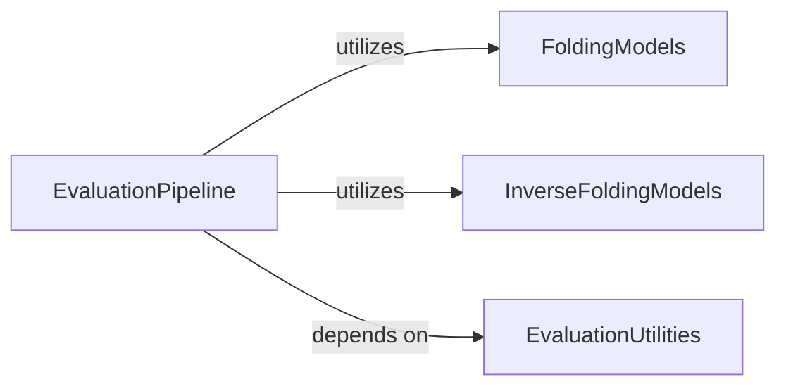

## Component Details

This graph illustrates the architecture of the Evaluation Module, which is responsible for the comprehensive evaluation workflow of generated protein structures. The main flow involves the `EvaluationPipeline` orchestrating various steps such as preprocessing, inverse folding, folding, scoring, and diversity analysis. It utilizes `FoldingModels` and `InverseFoldingModels` for their respective tasks and relies on `EvaluationUtilities` for common helper functions across the evaluation process.

### EvaluationPipeline
Orchestrates the comprehensive evaluation workflow for generated protein structures, managing preprocessing, inverse folding, folding, scoring, diversity analysis, and result processing.

**Related Classes/Methods**:

- <a href="https://github.com/aqlaboratory/genie/blob/master/evaluations/pipeline/pipeline.py#L34-L73" target="_blank" rel="noopener noreferrer">`genie.evaluations.pipeline.pipeline.Pipeline.evaluate` (34:73)</a>
- <a href="https://github.com/aqlaboratory/genie/blob/master/evaluations/pipeline/pipeline.py#L75-L104" target="_blank" rel="noopener noreferrer">`genie.evaluations.pipeline.pipeline.Pipeline._preprocess` (75:104)</a>
- <a href="https://github.com/aqlaboratory/genie/blob/master/evaluations/pipeline/pipeline.py#L106-L126" target="_blank" rel="noopener noreferrer">`genie.evaluations.pipeline.pipeline.Pipeline._inverse_fold` (106:126)</a>
- <a href="https://github.com/aqlaboratory/genie/blob/master/evaluations/pipeline/pipeline.py#L128-L160" target="_blank" rel="noopener noreferrer">`genie.evaluations.pipeline.pipeline.Pipeline._fold` (128:160)</a>
- <a href="https://github.com/aqlaboratory/genie/blob/master/evaluations/pipeline/pipeline.py#L162-L188" target="_blank" rel="noopener noreferrer">`genie.evaluations.pipeline.pipeline.Pipeline._compute_scores` (162:188)</a>
- <a href="https://github.com/aqlaboratory/genie/blob/master/evaluations/pipeline/pipeline.py#L190-L261" target="_blank" rel="noopener noreferrer">`genie.evaluations.pipeline.pipeline.Pipeline._aggregate_scores` (190:261)</a>
- <a href="https://github.com/aqlaboratory/genie/blob/master/evaluations/pipeline/pipeline.py#L263-L298" target="_blank" rel="noopener noreferrer">`genie.evaluations.pipeline.pipeline.Pipeline._compute_secondary_diversity` (263:298)</a>
- <a href="https://github.com/aqlaboratory/genie/blob/master/evaluations/pipeline/pipeline.py#L300-L389" target="_blank" rel="noopener noreferrer">`genie.evaluations.pipeline.pipeline.Pipeline._compute_tertiary_diversity` (300:389)</a>
- <a href="https://github.com/aqlaboratory/genie/blob/master/evaluations/pipeline/pipeline.py#L424-L483" target="_blank" rel="noopener noreferrer">`genie.evaluations.pipeline.pipeline.Pipeline._evaluate_motif_scaffolding` (424:483)</a>
- <a href="https://github.com/aqlaboratory/genie/blob/master/evaluations/pipeline/pipeline.py#L391-L422" target="_blank" rel="noopener noreferrer">`genie.evaluations.pipeline.pipeline.Pipeline._process_results` (391:422)</a>

### FoldingModels
Provides various models and utilities specifically for the protein folding step within the evaluation pipeline, converting protein sequences into 3D structures.

**Related Classes/Methods**:

- `genie.evaluations.pipeline.fold_models.esmfold` (full file reference)
- `genie.evaluations.pipeline.fold_models.model` (full file reference)

### InverseFoldingModels
Contains models and functionalities dedicated to the inverse protein folding process, used to predict amino acid sequences from given protein structures.

**Related Classes/Methods**:

- `genie.evaluations.pipeline.inverse_fold_models.model` (full file reference)
- `genie.evaluations.pipeline.inverse_fold_models.proteinmpnn` (full file reference)

### EvaluationUtilities
Offers a collection of general-purpose utility functions supporting various stages of the protein structure evaluation, including structural manipulation, geometric calculations, and secondary structure assignments.

**Related Classes/Methods**:

- <a href="https://github.com/aqlaboratory/genie/blob/master/evaluations/pipeline/utils.py#L19-L50" target="_blank" rel="noopener noreferrer">`genie.evaluations.pipeline.utils.hcluster.compute_cluster_tm` (19:50)</a>
- <a href="https://github.com/aqlaboratory/genie/blob/master/evaluations/pipeline/utils.py#L88-L90" target="_blank" rel="noopener noreferrer">`genie.evaluations.pipeline.utils.save_as_pdb.pad_right` (88:90)</a>
- <a href="https://github.com/aqlaboratory/genie/blob/master/evaluations/pipeline/utils.py#L84-L86" target="_blank" rel="noopener noreferrer">`genie.evaluations.pipeline.utils.save_as_pdb.pad_left` (84:86)</a>
- <a href="https://github.com/aqlaboratory/genie/blob/master/evaluations/pipeline/utils.py#L146-L165" target="_blank" rel="noopener noreferrer">`genie.evaluations.pipeline.utils.angle` (146:165)</a>
- <a href="https://github.com/aqlaboratory/genie/blob/master/evaluations/pipeline/utils.py#L167-L190" target="_blank" rel="noopener noreferrer">`genie.evaluations.pipeline.utils.dihedral` (167:190)</a>
- <a href="https://github.com/aqlaboratory/genie/blob/master/evaluations/pipeline/utils.py#L141-L144" target="_blank" rel="noopener noreferrer">`genie.evaluations.pipeline.utils.distance` (141:144)</a>
- <a href="https://github.com/aqlaboratory/genie/blob/master/evaluations/pipeline/utils.py#L220-L238" target="_blank" rel="noopener noreferrer">`genie.evaluations.pipeline.utils.cond_to_pred` (220:238)</a>
- <a href="https://github.com/aqlaboratory/genie/blob/master/evaluations/pipeline/utils.py#L245-L257" target="_blank" rel="noopener noreferrer">`genie.evaluations.pipeline.utils.assign_secondary_structures.decode` (245:257)</a>
- <a href="https://github.com/aqlaboratory/genie/blob/master/evaluations/pipeline/utils.py#L324-L341" target="_blank" rel="noopener noreferrer">`genie.evaluations.pipeline.utils.assign_left_handed_helices` (324:341)</a>

### [FAQ](https://github.com/CodeBoarding/GeneratedOnBoardings/tree/main?tab=readme-ov-file#faq)