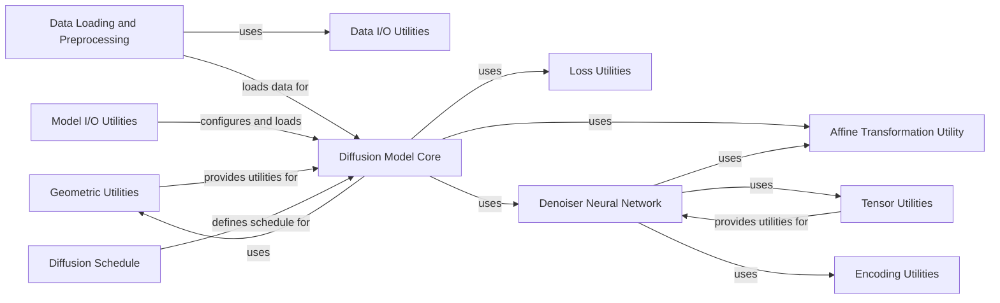

## Component Details

This architecture overview details the core components of the Genie project, focusing on its diffusion model for 3D structure generation. The system is built around the `Diffusion Model Core`, which orchestrates the diffusion process, leveraging a `Denoiser Neural Network` to predict noise and refine structures. Data is managed by the `Data Loading and Preprocessing` component, which feeds into the diffusion model. Various utility components, including `Affine Transformation Utility`, `Geometric Utilities`, `Tensor Utilities`, `Model I/O Utilities`, `Data I/O Utilities`, `Encoding Utilities`, and `Loss Utilities`, provide foundational functionalities for data manipulation, model operations, and performance evaluation. The `Diffusion Schedule` component defines the noise schedules crucial for the diffusion process. The primary purpose is to generate 3D structures using a diffusion-based approach, with a clear separation of concerns among data handling, model execution, and utility functions.

### Affine Transformation Utility
This component, primarily represented by the `T` class in `genie.genie.utils.affine_utils`, handles 3D affine transformations. It encapsulates rotation matrices and translation vectors, providing methods for composition, application, inversion, and various static methods for creating identity transformations or transformations from different representations (e.g., 4x4 matrices, 3 points). It's fundamental for manipulating 3D coordinates and orientations within the Genie system.

**Related Classes/Methods**:

- <a href="https://github.com/aqlaboratory/genie/blob/master/genie/utils/affine_utils.py#L53-L295" target="_blank" rel="noopener noreferrer">`genie.genie.utils.affine_utils.T` (53:295)</a>
- <a href="https://github.com/aqlaboratory/genie/blob/master/genie/utils/affine_utils.py#L54-L72" target="_blank" rel="noopener noreferrer">`genie.genie.utils.affine_utils.T.__init__` (54:72)</a>
- <a href="https://github.com/aqlaboratory/genie/blob/master/genie/utils/affine_utils.py#L74-L80" target="_blank" rel="noopener noreferrer">`genie.genie.utils.affine_utils.T.__getitem__` (74:80)</a>
- <a href="https://github.com/aqlaboratory/genie/blob/master/genie/utils/affine_utils.py#L88-L92" target="_blank" rel="noopener noreferrer">`genie.genie.utils.affine_utils.T.__mul__` (88:92)</a>
- <a href="https://github.com/aqlaboratory/genie/blob/master/genie/utils/affine_utils.py#L94-L95" target="_blank" rel="noopener noreferrer">`genie.genie.utils.affine_utils.T.__rmul__` (94:95)</a>
- <a href="https://github.com/aqlaboratory/genie/blob/master/genie/utils/affine_utils.py#L108-L115" target="_blank" rel="noopener noreferrer">`genie.genie.utils.affine_utils.T.compose` (108:115)</a>
- <a href="https://github.com/aqlaboratory/genie/blob/master/genie/utils/affine_utils.py#L117-L120" target="_blank" rel="noopener noreferrer">`genie.genie.utils.affine_utils.T.apply` (117:120)</a>
- <a href="https://github.com/aqlaboratory/genie/blob/master/genie/utils/affine_utils.py#L122-L125" target="_blank" rel="noopener noreferrer">`genie.genie.utils.affine_utils.T.invert_apply` (122:125)</a>
- <a href="https://github.com/aqlaboratory/genie/blob/master/genie/utils/affine_utils.py#L127-L131" target="_blank" rel="noopener noreferrer">`genie.genie.utils.affine_utils.T.invert` (127:131)</a>
- <a href="https://github.com/aqlaboratory/genie/blob/master/genie/utils/affine_utils.py#L133-L139" target="_blank" rel="noopener noreferrer">`genie.genie.utils.affine_utils.T.unsqueeze` (133:139)</a>
- <a href="https://github.com/aqlaboratory/genie/blob/master/genie/utils/affine_utils.py#L162-L166" target="_blank" rel="noopener noreferrer">`genie.genie.utils.affine_utils.T.identity` (162:166)</a>
- <a href="https://github.com/aqlaboratory/genie/blob/master/genie/utils/affine_utils.py#L169-L172" target="_blank" rel="noopener noreferrer">`genie.genie.utils.affine_utils.T.from_4x4` (169:172)</a>
- <a href="https://github.com/aqlaboratory/genie/blob/master/genie/utils/affine_utils.py#L182-L183" target="_blank" rel="noopener noreferrer">`genie.genie.utils.affine_utils.T.from_tensor` (182:183)</a>
- <a href="https://github.com/aqlaboratory/genie/blob/master/genie/utils/affine_utils.py#L186-L202" target="_blank" rel="noopener noreferrer">`genie.genie.utils.affine_utils.T.from_3_points` (186:202)</a>
- <a href="https://github.com/aqlaboratory/genie/blob/master/genie/utils/affine_utils.py#L205-L215" target="_blank" rel="noopener noreferrer">`genie.genie.utils.affine_utils.T.concat` (205:215)</a>
- <a href="https://github.com/aqlaboratory/genie/blob/master/genie/utils/affine_utils.py#L217-L236" target="_blank" rel="noopener noreferrer">`genie.genie.utils.affine_utils.T.map_tensor_fn` (217:236)</a>
- <a href="https://github.com/aqlaboratory/genie/blob/master/genie/utils/affine_utils.py#L238-L239" target="_blank" rel="noopener noreferrer">`genie.genie.utils.affine_utils.T.stop_rot_gradient` (238:239)</a>
- <a href="https://github.com/aqlaboratory/genie/blob/master/genie/utils/affine_utils.py#L241-L242" target="_blank" rel="noopener noreferrer">`genie.genie.utils.affine_utils.T.scale_translation` (241:242)</a>
- <a href="https://github.com/aqlaboratory/genie/blob/master/genie/utils/affine_utils.py#L245-L295" target="_blank" rel="noopener noreferrer">`genie.genie.utils.affine_utils.T.make_transform_from_reference` (245:295)</a>
- <a href="https://github.com/aqlaboratory/genie/blob/master/genie/utils/affine_utils.py#L23-L41" target="_blank" rel="noopener noreferrer">`genie.genie.utils.affine_utils.rot_matmul` (23:41)</a>
- <a href="https://github.com/aqlaboratory/genie/blob/master/genie/utils/affine_utils.py#L43-L51" target="_blank" rel="noopener noreferrer">`genie.genie.utils.affine_utils.rot_vec_mul` (43:51)</a>
- <a href="https://github.com/aqlaboratory/genie/blob/master/genie/utils/affine_utils.py#L321-L332" target="_blank" rel="noopener noreferrer">`genie.utils.affine_utils.quat_to_rot` (321:332)</a>

### Geometric Utilities
This component provides utility functions for geometric calculations, such as computing Frenet frames and calculating distances. These functions are essential for handling 3D structural data and evaluating model performance.

**Related Classes/Methods**:

- <a href="https://github.com/aqlaboratory/genie/blob/master/genie/utils/geo_utils.py#L4-L6" target="_blank" rel="noopener noreferrer">`genie.utils.geo_utils.distance` (4:6)</a>
- <a href="https://github.com/aqlaboratory/genie/blob/master/genie/utils/geo_utils.py#L32-L58" target="_blank" rel="noopener noreferrer">`genie.utils.geo_utils.compute_frenet_frames` (32:58)</a>

### Tensor Utilities
This component provides a collection of utility functions for tensor manipulations, including stacking tensor dictionaries, mapping functions over dictionaries, and chunking layers. These utilities are crucial for efficient and flexible tensor operations within the neural network models.

**Related Classes/Methods**:

- <a href="https://github.com/aqlaboratory/genie/blob/master/genie/utils/tensor_utils.py#L46-L56" target="_blank" rel="noopener noreferrer">`genie.genie.utils.tensor_utils.stack_tensor_dicts` (46:56)</a>
- <a href="https://github.com/aqlaboratory/genie/blob/master/genie/utils/tensor_utils.py#L82-L90" target="_blank" rel="noopener noreferrer">`genie.genie.utils.tensor_utils.dict_map` (82:90)</a>
- <a href="https://github.com/aqlaboratory/genie/blob/master/genie/utils/tensor_utils.py#L93-L104" target="_blank" rel="noopener noreferrer">`genie.genie.utils.tensor_utils.tree_map` (93:104)</a>
- <a href="https://github.com/aqlaboratory/genie/blob/master/genie/utils/tensor_utils.py#L108-L212" target="_blank" rel="noopener noreferrer">`genie.genie.utils.tensor_utils.chunk_layer` (108:212)</a>
- <a href="https://github.com/aqlaboratory/genie/blob/master/genie/utils/tensor_utils.py#L137-L151" target="_blank" rel="noopener noreferrer">`genie.genie.utils.tensor_utils.chunk_layer.fetch_dims` (137:151)</a>
- <a href="https://github.com/aqlaboratory/genie/blob/master/genie/utils/tensor_utils.py#L153-L160" target="_blank" rel="noopener noreferrer">`genie.genie.utils.tensor_utils.chunk_layer.assign` (153:160)</a>
- <a href="https://github.com/aqlaboratory/genie/blob/master/genie/utils/tensor_utils.py#L21-L24" target="_blank" rel="noopener noreferrer">`genie.genie.utils.tensor_utils.permute_final_dims` (21:24)</a>
- <a href="https://github.com/aqlaboratory/genie/blob/master/genie/utils/tensor_utils.py#L27-L28" target="_blank" rel="noopener noreferrer">`genie.genie.utils.tensor_utils.flatten_final_dims` (27:28)</a>

### Model I/O Utilities
This component is responsible for loading and managing model configurations and checkpoints. The `load_model` function handles the retrieval of model configurations and the loading of pre-trained diffusion models from specified checkpoints.

**Related Classes/Methods**:

- <a href="https://github.com/aqlaboratory/genie/blob/master/genie/utils/model_io.py#L23-L65" target="_blank" rel="noopener noreferrer">`genie.genie.utils.model_io.load_model` (23:65)</a>
- <a href="https://github.com/aqlaboratory/genie/blob/master/genie/utils/model_io.py#L9-L14" target="_blank" rel="noopener noreferrer">`genie.genie.utils.model_io.get_versions` (9:14)</a>
- <a href="https://github.com/aqlaboratory/genie/blob/master/genie/utils/model_io.py#L16-L21" target="_blank" rel="noopener noreferrer">`genie.genie.utils.model_io.get_epochs` (16:21)</a>

### Data I/O Utilities
This component provides utility functions for handling data input and output operations, facilitating the loading and processing of datasets.

**Related Classes/Methods**:

- `genie.genie.utils.data_io` (full file reference)

### Encoding Utilities
This component offers functionalities for encoding various features, which are then used as inputs for neural network models within the project.

**Related Classes/Methods**:

- `genie.genie.utils.encoding` (full file reference)

### Loss Utilities
This component contains functions for calculating various loss metrics, such as Root Mean Square Deviation (RMSD), which are crucial for training and evaluating models.

**Related Classes/Methods**:

- <a href="https://github.com/aqlaboratory/genie/blob/master/genie/utils/loss.py#L3-L5" target="_blank" rel="noopener noreferrer">`genie.genie.utils.loss.rmsd` (3:5)</a>

### Diffusion Model Core
The `Genie` class in `genie.genie.diffusion.genie` serves as the core of the diffusion model. It manages the diffusion process, including setting up the noise schedule, transforming input data, sampling timesteps, and performing forward (q) and reverse (p) diffusion steps. It also defines the loss function used for training the denoiser model.

**Related Classes/Methods**:

- <a href="https://github.com/aqlaboratory/genie/blob/master/genie/diffusion/genie.py#L9-L109" target="_blank" rel="noopener noreferrer">`genie.genie.diffusion.genie.Genie` (9:109)</a>
- <a href="https://github.com/aqlaboratory/genie/blob/master/genie/diffusion/genie.py#L11-L30" target="_blank" rel="noopener noreferrer">`genie.genie.diffusion.genie.Genie.setup_schedule` (11:30)</a>
- <a href="https://github.com/aqlaboratory/genie/blob/master/genie/diffusion/genie.py#L32-L42" target="_blank" rel="noopener noreferrer">`genie.genie.diffusion.genie.Genie.transform` (32:42)</a>
- <a href="https://github.com/aqlaboratory/genie/blob/master/genie/diffusion/genie.py#L47-L51" target="_blank" rel="noopener noreferrer">`genie.genie.diffusion.genie.Genie.sample_frames` (47:51)</a>
- <a href="https://github.com/aqlaboratory/genie/blob/master/genie/diffusion/genie.py#L53-L63" target="_blank" rel="noopener noreferrer">`genie.genie.diffusion.genie.Genie.q` (53:63)</a>
- <a href="https://github.com/aqlaboratory/genie/blob/master/genie/diffusion/genie.py#L65-L97" target="_blank" rel="noopener noreferrer">`genie.genie.diffusion.genie.Genie.p` (65:97)</a>
- <a href="https://github.com/aqlaboratory/genie/blob/master/genie/diffusion/genie.py#L99-L109" target="_blank" rel="noopener noreferrer">`genie.genie.diffusion.genie.Genie.loss_fn` (99:109)</a>

### Denoiser Neural Network
The `Denoiser` class in `genie.model.model` represents the neural network responsible for predicting noise in the diffusion process. It comprises several sub-networks like `SingleFeatureNet`, `PairFeatureNet`, `PairTransformNet`, and `StructureNet`, which collectively process input features and predict the noise component of the 3D coordinates.

**Related Classes/Methods**:

- <a href="https://github.com/aqlaboratory/genie/blob/master/genie/model/model.py#L9-L70" target="_blank" rel="noopener noreferrer">`genie.model.model.Denoiser` (9:70)</a>
- <a href="https://github.com/aqlaboratory/genie/blob/master/genie/model/model.py#L63-L70" target="_blank" rel="noopener noreferrer">`genie.model.model.Denoiser.forward` (63:70)</a>

### Data Loading and Preprocessing
This component handles the loading and preprocessing of SCOPe dataset. The `SCOPeDataModule` orchestrates the data pipeline, loading file paths and creating `SCOPeDataset` instances. The `SCOPeDataset` is responsible for loading individual coordinate files and applying necessary transformations like padding or cropping.

**Related Classes/Methods**:

- <a href="https://github.com/aqlaboratory/genie/blob/master/genie/data/data_module.py#L9-L42" target="_blank" rel="noopener noreferrer">`genie.genie.data.data_module.SCOPeDataModule` (9:42)</a>
- <a href="https://github.com/aqlaboratory/genie/blob/master/genie/data/data_module.py#L24-L39" target="_blank" rel="noopener noreferrer">`genie.genie.data.data_module.SCOPeDataModule.setup` (24:39)</a>
- <a href="https://github.com/aqlaboratory/genie/blob/master/genie/data/dataset.py#L6-L31" target="_blank" rel="noopener noreferrer">`genie.genie.data.dataset.SCOPeDataset` (6:31)</a>
- <a href="https://github.com/aqlaboratory/genie/blob/master/genie/data/dataset.py#L18-L31" target="_blank" rel="noopener noreferrer">`genie.genie.data.dataset.SCOPeDataset.__getitem__` (18:31)</a>

### Diffusion Schedule
This component defines different beta schedules for the diffusion process, such as linear and cosine schedules. The `get_betas` function allows for selecting and generating the appropriate noise schedule based on configuration, which is critical for controlling the diffusion process.

**Related Classes/Methods**:

- <a href="https://github.com/aqlaboratory/genie/blob/master/genie/diffusion/schedule.py#L4-L11" target="_blank" rel="noopener noreferrer">`genie.genie.diffusion.schedule.get_betas` (4:11)</a>
- <a href="https://github.com/aqlaboratory/genie/blob/master/genie/diffusion/schedule.py#L13-L14" target="_blank" rel="noopener noreferrer">`genie.genie.diffusion.schedule.linear_beta_schedule` (13:14)</a>
- <a href="https://github.com/aqlaboratory/genie/blob/master/genie/diffusion/schedule.py#L16-L22" target="_blank" rel="noopener noreferrer">`genie.genie.diffusion.schedule.cosine_beta_schedule` (16:22)</a>

### [FAQ](https://github.com/CodeBoarding/GeneratedOnBoardings/tree/main?tab=readme-ov-file#faq)