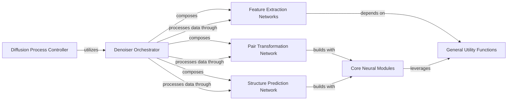

## Component Details

The Protein Denoiser Network is a sophisticated neural network designed to predict and remove noise from protein structures. It operates by orchestrating several specialized sub-networks: Feature Extraction Networks for initial data processing, a Pair Transformation Network for refining inter-residue relationships, and a Structure Prediction Network for constructing and updating 3D molecular structures. These operations are built upon a foundation of reusable Core Neural Modules and supported by General Utility Functions. The entire denoising process is managed by a Diffusion Process Controller, which iteratively refines the noisy structures.

### Denoiser Orchestrator
The central model that integrates and sequences the operations of various sub-networks to perform the overall denoising task. It acts as an orchestrator, combining outputs from specialized sub-networks to refine molecular structures.

**Related Classes/Methods**:

- <a href="https://github.com/aqlaboratory/genie/blob/master/genie/model/model.py#L9-L70" target="_blank" rel="noopener noreferrer">`genie.model.model.Denoiser` (9:70)</a>
- <a href="https://github.com/aqlaboratory/genie/blob/master/genie/model/model.py#L11-L61" target="_blank" rel="noopener noreferrer">`genie.model.model.Denoiser.__init__` (11:61)</a>
- <a href="https://github.com/aqlaboratory/genie/blob/master/genie/model/model.py#L63-L70" target="_blank" rel="noopener noreferrer">`genie.model.model.Denoiser.forward` (63:70)</a>

### Feature Extraction Networks
A group of networks responsible for extracting and encoding single and pair-wise features from input data, preparing them for further processing by the transformation and structure prediction networks.

**Related Classes/Methods**:

- <a href="https://github.com/aqlaboratory/genie/blob/master/genie/model/single_feature_net.py#L6-L41" target="_blank" rel="noopener noreferrer">`genie.model.single_feature_net.SingleFeatureNet` (6:41)</a>
- <a href="https://github.com/aqlaboratory/genie/blob/master/genie/model/single_feature_net.py#L23-L41" target="_blank" rel="noopener noreferrer">`genie.model.single_feature_net.SingleFeatureNet.forward` (23:41)</a>
- <a href="https://github.com/aqlaboratory/genie/blob/master/genie/model/pair_feature_net.py#L6-L72" target="_blank" rel="noopener noreferrer">`genie.model.pair_feature_net.PairFeatureNet` (6:72)</a>
- <a href="https://github.com/aqlaboratory/genie/blob/master/genie/model/pair_feature_net.py#L8-L22" target="_blank" rel="noopener noreferrer">`genie.model.pair_feature_net.PairFeatureNet.__init__` (8:22)</a>
- <a href="https://github.com/aqlaboratory/genie/blob/master/genie/model/pair_feature_net.py#L49-L50" target="_blank" rel="noopener noreferrer">`genie.model.pair_feature_net.PairFeatureNet.template` (49:50)</a>
- <a href="https://github.com/aqlaboratory/genie/blob/master/genie/model/pair_feature_net.py#L52-L72" target="_blank" rel="noopener noreferrer">`genie.model.pair_feature_net.PairFeatureNet.forward` (52:72)</a>

### Pair Transformation Network
Processes and refines pair-wise features through multiple layers of transformations, including triangular multiplicative updates and triangular attention mechanisms, to capture complex inter-residue relationships.

**Related Classes/Methods**:

- <a href="https://github.com/aqlaboratory/genie/blob/master/genie/model/pair_transform_net.py#L74-L107" target="_blank" rel="noopener noreferrer">`genie.model.pair_transform_net.PairTransformNet` (74:107)</a>
- <a href="https://github.com/aqlaboratory/genie/blob/master/genie/model/pair_transform_net.py#L76-L103" target="_blank" rel="noopener noreferrer">`genie.model.pair_transform_net.PairTransformNet.__init__` (76:103)</a>
- <a href="https://github.com/aqlaboratory/genie/blob/master/genie/model/pair_transform_net.py#L17-L72" target="_blank" rel="noopener noreferrer">`genie.model.pair_transform_net.PairTransformLayer` (17:72)</a>
- <a href="https://github.com/aqlaboratory/genie/blob/master/genie/model/pair_transform_net.py#L19-L59" target="_blank" rel="noopener noreferrer">`genie.model.pair_transform_net.PairTransformLayer.__init__` (19:59)</a>
- <a href="https://github.com/aqlaboratory/genie/blob/master/genie/model/pair_transform_net.py#L61-L72" target="_blank" rel="noopener noreferrer">`genie.model.pair_transform_net.PairTransformLayer.forward` (61:72)</a>

### Structure Prediction Network
Constructs and updates the 3D molecular structure based on the processed single and pair features, utilizing invariant point attention and structure transition layers to refine atomic coordinates.

**Related Classes/Methods**:

- <a href="https://github.com/aqlaboratory/genie/blob/master/genie/model/structure_net.py#L55-L87" target="_blank" rel="noopener noreferrer">`genie.model.structure_net.StructureNet` (55:87)</a>
- <a href="https://github.com/aqlaboratory/genie/blob/master/genie/model/structure_net.py#L57-L82" target="_blank" rel="noopener noreferrer">`genie.model.structure_net.StructureNet.__init__` (57:82)</a>
- <a href="https://github.com/aqlaboratory/genie/blob/master/genie/model/structure_net.py#L8-L52" target="_blank" rel="noopener noreferrer">`genie.model.structure_net.StructureLayer` (8:52)</a>
- <a href="https://github.com/aqlaboratory/genie/blob/master/genie/model/structure_net.py#L10-L42" target="_blank" rel="noopener noreferrer">`genie.model.structure_net.StructureLayer.__init__` (10:42)</a>
- <a href="https://github.com/aqlaboratory/genie/blob/master/genie/model/structure_net.py#L44-L52" target="_blank" rel="noopener noreferrer">`genie.model.structure_net.StructureLayer.forward` (44:52)</a>

### Diffusion Process Controller
Manages the overall diffusion process, including probabilistic sampling and loss calculation, by utilizing the Denoiser Orchestrator to iteratively refine noisy molecular structures.

**Related Classes/Methods**:

- <a href="https://github.com/aqlaboratory/genie/blob/master/genie/diffusion/genie.py#L9-L109" target="_blank" rel="noopener noreferrer">`genie.diffusion.genie.Genie` (9:109)</a>
- <a href="https://github.com/aqlaboratory/genie/blob/master/genie/diffusion/diffusion.py#L9-L99" target="_blank" rel="noopener noreferrer">`genie.diffusion.diffusion.Diffusion` (9:99)</a>

### Core Neural Modules
Fundamental building blocks of the neural networks, implementing specific operations like attention mechanisms, multiplicative updates, linear transformations, and dropout layers, which are reused across various parts of the model.

**Related Classes/Methods**:

- <a href="https://github.com/aqlaboratory/genie/blob/master/genie/model/modules/backbone_update.py#L23-L65" target="_blank" rel="noopener noreferrer">`genie.model.modules.backbone_update.BackboneUpdate` (23:65)</a>
- <a href="https://github.com/aqlaboratory/genie/blob/master/genie/model/modules/dropout.py#L62-L67" target="_blank" rel="noopener noreferrer">`genie.model.modules.dropout.DropoutRowwise` (62:67)</a>
- <a href="https://github.com/aqlaboratory/genie/blob/master/genie/model/modules/dropout.py#L70-L75" target="_blank" rel="noopener noreferrer">`genie.model.modules.dropout.DropoutColumnwise` (70:75)</a>
- <a href="https://github.com/aqlaboratory/genie/blob/master/genie/model/modules/invariant_point_attention.py#L28-L260" target="_blank" rel="noopener noreferrer">`genie.model.modules.invariant_point_attention.InvariantPointAttention` (28:260)</a>
- <a href="https://github.com/aqlaboratory/genie/blob/master/genie/model/modules/pair_transition.py#L23-L86" target="_blank" rel="noopener noreferrer">`genie.model.modules.pair_transition.PairTransition` (23:86)</a>
- <a href="https://github.com/aqlaboratory/genie/blob/master/genie/model/modules/primitives.py#L49-L60" target="_blank" rel="noopener noreferrer">`genie.model.modules.primitives.trunc_normal_init_` (49:60)</a>
- <a href="https://github.com/aqlaboratory/genie/blob/master/genie/model/modules/primitives.py#L63-L64" target="_blank" rel="noopener noreferrer">`genie.model.modules.primitives.lecun_normal_init_` (63:64)</a>
- <a href="https://github.com/aqlaboratory/genie/blob/master/genie/model/modules/primitives.py#L67-L68" target="_blank" rel="noopener noreferrer">`genie.model.modules.primitives.he_normal_init_` (67:68)</a>
- <a href="https://github.com/aqlaboratory/genie/blob/master/genie/model/modules/primitives.py#L95-L159" target="_blank" rel="noopener noreferrer">`genie.model.modules.primitives.Linear` (95:159)</a>
- <a href="https://github.com/aqlaboratory/genie/blob/master/genie/model/modules/primitives.py#L162-L280" target="_blank" rel="noopener noreferrer">`genie.model.modules.primitives.Attention` (162:280)</a>
- <a href="https://github.com/aqlaboratory/genie/blob/master/genie/model/modules/structure_transition.py#L46-L69" target="_blank" rel="noopener noreferrer">`genie.model.modules.structure_transition.StructureTransition` (46:69)</a>
- <a href="https://github.com/aqlaboratory/genie/blob/master/genie/model/modules/triangular_attention.py#L132-L136" target="_blank" rel="noopener noreferrer">`genie.model.modules.triangular_attention.TriangleAttentionStartingNode` (132:136)</a>
- <a href="https://github.com/aqlaboratory/genie/blob/master/genie/model/modules/triangular_attention.py#L139-L143" target="_blank" rel="noopener noreferrer">`genie.model.modules.triangular_attention.TriangleAttentionEndingNode` (139:143)</a>
- <a href="https://github.com/aqlaboratory/genie/blob/master/genie/model/modules/triangular_multiplicative_update.py#L112-L118" target="_blank" rel="noopener noreferrer">`genie.model.modules.triangular_multiplicative_update.TriangleMultiplicationOutgoing` (112:118)</a>
- <a href="https://github.com/aqlaboratory/genie/blob/master/genie/model/modules/triangular_multiplicative_update.py#L121-L127" target="_blank" rel="noopener noreferrer">`genie.model.modules.triangular_multiplicative_update.TriangleMultiplicationIncoming` (121:127)</a>
- <a href="https://github.com/aqlaboratory/genie/blob/master/genie/model/modules/triangular_multiplicative_update.py#L24-L109" target="_blank" rel="noopener noreferrer">`genie.model.modules.triangular_multiplicative_update.TriangleMultiplicativeUpdate` (24:109)</a>

### General Utility Functions
Provides common utility functions for tensor manipulation, mathematical operations, geometric transformations (e.g., distance, affine transformations), and encoding schemes (e.g., sinusoidal encoding) that support various model components.

**Related Classes/Methods**:

- <a href="https://github.com/aqlaboratory/genie/blob/master/genie/utils/encoding.py#L4-L25" target="_blank" rel="noopener noreferrer">`genie.utils.encoding.sinusoidal_encoding` (4:25)</a>
- <a href="https://github.com/aqlaboratory/genie/blob/master/genie/utils/geo_utils.py#L4-L6" target="_blank" rel="noopener noreferrer">`genie.utils.geo_utils.distance` (4:6)</a>
- <a href="https://github.com/aqlaboratory/genie/blob/master/genie/utils/affine_utils.py#L53-L295" target="_blank" rel="noopener noreferrer">`genie.utils.affine_utils.T` (53:295)</a>
- <a href="https://github.com/aqlaboratory/genie/blob/master/genie/utils/affine_utils.py#L321-L332" target="_blank" rel="noopener noreferrer">`genie.utils.affine_utils.quat_to_rot` (321:332)</a>
- <a href="https://github.com/aqlaboratory/genie/blob/master/genie/utils/geo_utils.py#L32-L58" target="_blank" rel="noopener noreferrer">`genie.utils.geo_utils.compute_frenet_frames` (32:58)</a>
- <a href="https://github.com/aqlaboratory/genie/blob/master/genie/utils/tensor_utils.py#L21-L24" target="_blank" rel="noopener noreferrer">`genie.utils.tensor_utils.permute_final_dims` (21:24)</a>
- <a href="https://github.com/aqlaboratory/genie/blob/master/genie/utils/tensor_utils.py#L108-L212" target="_blank" rel="noopener noreferrer">`genie.utils.tensor_utils.chunk_layer` (108:212)</a>
- <a href="https://github.com/aqlaboratory/genie/blob/master/genie/utils/tensor_utils.py#L27-L28" target="_blank" rel="noopener noreferrer">`genie.utils.tensor_utils.flatten_final_dims` (27:28)</a>
- <a href="https://github.com/aqlaboratory/genie/blob/master/genie/model/template.py#L5-L7" target="_blank" rel="noopener noreferrer">`genie.model.template.get_template_fn` (5:7)</a>
- <a href="https://github.com/aqlaboratory/genie/blob/master/genie/model/template.py#L9-L17" target="_blank" rel="noopener noreferrer">`genie.model.template.v1` (9:17)</a>

### [FAQ](https://github.com/CodeBoarding/GeneratedOnBoardings/tree/main?tab=readme-ov-file#faq)