```mermaid
graph LR
    Application_Orchestrators["Application Orchestrators"]
    Configuration_Manager["Configuration Manager"]
    Data_Management["Data Management"]
    Diffusion_Model_Core_Genie_["Diffusion Model Core (Genie)"]
    Protein_Denoiser_Network["Protein Denoiser Network"]
    General_Utilities["General Utilities"]
    Evaluation_Module["Evaluation Module"]
    Application_Orchestrators -- "loads configuration from" --> Configuration_Manager
    Application_Orchestrators -- "initializes data module from" --> Data_Management
    Application_Orchestrators -- "orchestrates training and sampling of" --> Diffusion_Model_Core_Genie_
    Application_Orchestrators -- "utilizes for model I/O" --> General_Utilities
    Diffusion_Model_Core_Genie_ -- "delegates noise prediction to" --> Protein_Denoiser_Network
    Diffusion_Model_Core_Genie_ -- "leverages for core operations" --> General_Utilities
    Protein_Denoiser_Network -- "leverages for internal computations" --> General_Utilities
    Data_Management -- "provides data to" --> Application_Orchestrators
    Evaluation_Module -- "processes data from" --> Data_Management
    Evaluation_Module -- "utilizes for evaluation tasks" --> General_Utilities
    Configuration_Manager -- "provides configuration to" --> Diffusion_Model_Core_Genie_
    click Application_Orchestrators href "https://github.com/CodeBoarding/genie/blob/main/.codeboarding//genie/Application Orchestrators.md" "Details"
    click Configuration_Manager href "https://github.com/CodeBoarding/genie/blob/main/.codeboarding//genie/Configuration Manager.md" "Details"
    click Data_Management href "https://github.com/CodeBoarding/genie/blob/main/.codeboarding//genie/Data Management.md" "Details"
    click Diffusion_Model_Core_Genie_ href "https://github.com/CodeBoarding/genie/blob/main/.codeboarding//genie/Diffusion Model Core (Genie).md" "Details"
    click Protein_Denoiser_Network href "https://github.com/CodeBoarding/genie/blob/main/.codeboarding//genie/Protein Denoiser Network.md" "Details"
    click General_Utilities href "https://github.com/CodeBoarding/genie/blob/main/.codeboarding//genie/General Utilities.md" "Details"
    click Evaluation_Module href "https://github.com/CodeBoarding/genie/blob/main/.codeboarding//genie/Evaluation Module.md" "Details"
```

## Component Details

The `genie` project implements a diffusion model for generating protein structures. The main flow involves orchestrating training and sampling processes, managing configuration, handling protein data, and utilizing a core diffusion model with a specialized denoiser network. An evaluation module is also present to assess the quality of generated structures. Various utility modules support these core functionalities.

### Application Orchestrators
Manages the high-level execution flows for both training and sampling processes, handling configuration loading, model instantiation, data preparation, and the main loops for each operation.

**Related Classes/Methods**:

- <a href="https://github.com/aqlaboratory/genie/blob/master/genie/train.py#L11-L55" target="_blank" rel="noopener noreferrer">`genie.genie.train.main` (11:55)</a>
- <a href="https://github.com/aqlaboratory/genie/blob/master/genie/sample.py#L10-L47" target="_blank" rel="noopener noreferrer">`genie.genie.sample.main` (10:47)</a>

### Configuration Manager
Responsible for loading, parsing, and providing application-wide configuration parameters from various sources.

**Related Classes/Methods**:

- <a href="https://github.com/aqlaboratory/genie/blob/master/genie/config.py#L7-L92" target="_blank" rel="noopener noreferrer">`genie.genie.config.Config` (7:92)</a>
- <a href="https://github.com/aqlaboratory/genie/blob/master/genie/config.py#L9-L11" target="_blank" rel="noopener noreferrer">`genie.genie.config.Config.__init__` (9:11)</a>
- <a href="https://github.com/aqlaboratory/genie/blob/master/genie/config.py#L80-L92" target="_blank" rel="noopener noreferrer">`genie.genie.config.Config._load_config` (80:92)</a>
- <a href="https://github.com/aqlaboratory/genie/blob/master/genie/config.py#L13-L78" target="_blank" rel="noopener noreferrer">`genie.genie.config.Config._create_config` (13:78)</a>

### Data Management
Handles the loading, preprocessing, and batching of protein structure datasets (e.g., SCOPe) for training and evaluation, and provides general data I/O functionalities.

**Related Classes/Methods**:

- <a href="https://github.com/aqlaboratory/genie/blob/master/genie/data/data_module.py#L9-L42" target="_blank" rel="noopener noreferrer">`genie.genie.data.data_module.SCOPeDataModule` (9:42)</a>
- <a href="https://github.com/aqlaboratory/genie/blob/master/genie/data/dataset.py#L6-L31" target="_blank" rel="noopener noreferrer">`genie.genie.data.dataset.SCOPeDataset` (6:31)</a>
- <a href="https://github.com/aqlaboratory/genie/blob/master/genie/data/dataset.py#L18-L31" target="_blank" rel="noopener noreferrer">`genie.genie.data.dataset.SCOPeDataset.__getitem__` (18:31)</a>
- <a href="https://github.com/aqlaboratory/genie/blob/master/genie/utils/data_io.py#L17-L80" target="_blank" rel="noopener noreferrer">`genie.genie.utils.data_io.load_filepaths` (17:80)</a>
- <a href="https://github.com/aqlaboratory/genie/blob/master/genie/utils/data_io.py#L6-L7" target="_blank" rel="noopener noreferrer">`genie.genie.utils.data_io.load_coord` (6:7)</a>
- <a href="https://github.com/aqlaboratory/genie/blob/master/genie/utils/data_io.py#L9-L15" target="_blank" rel="noopener noreferrer">`genie.genie.utils.data_io.load_classes` (9:15)</a>

### Diffusion Model Core (Genie)
Implements the core diffusion process for protein generation, including noise scheduling, forward and reverse diffusion steps, and loss calculation. It orchestrates the interaction with the Protein Denoiser Network.

**Related Classes/Methods**:

- <a href="https://github.com/aqlaboratory/genie/blob/master/genie/diffusion/genie.py#L9-L109" target="_blank" rel="noopener noreferrer">`genie.genie.diffusion.genie.Genie` (9:109)</a>
- <a href="https://github.com/aqlaboratory/genie/blob/master/genie/diffusion/genie.py#L11-L30" target="_blank" rel="noopener noreferrer">`genie.genie.diffusion.genie.Genie.setup_schedule` (11:30)</a>
- <a href="https://github.com/aqlaboratory/genie/blob/master/genie/diffusion/genie.py#L32-L42" target="_blank" rel="noopener noreferrer">`genie.genie.diffusion.genie.Genie.transform` (32:42)</a>
- <a href="https://github.com/aqlaboratory/genie/blob/master/genie/diffusion/genie.py#L44-L45" target="_blank" rel="noopener noreferrer">`genie.genie.diffusion.genie.Genie.sample_timesteps` (44:45)</a>
- <a href="https://github.com/aqlaboratory/genie/blob/master/genie/diffusion/genie.py#L47-L51" target="_blank" rel="noopener noreferrer">`genie.genie.diffusion.genie.Genie.sample_frames` (47:51)</a>
- <a href="https://github.com/aqlaboratory/genie/blob/master/genie/diffusion/genie.py#L53-L63" target="_blank" rel="noopener noreferrer">`genie.genie.diffusion.genie.Genie.q` (53:63)</a>
- <a href="https://github.com/aqlaboratory/genie/blob/master/genie/diffusion/genie.py#L65-L97" target="_blank" rel="noopener noreferrer">`genie.genie.diffusion.genie.Genie.p` (65:97)</a>
- <a href="https://github.com/aqlaboratory/genie/blob/master/genie/diffusion/genie.py#L99-L109" target="_blank" rel="noopener noreferrer">`genie.genie.diffusion.genie.Genie.loss_fn` (99:109)</a>
- <a href="https://github.com/aqlaboratory/genie/blob/master/genie/diffusion/diffusion.py#L9-L99" target="_blank" rel="noopener noreferrer">`genie.genie.diffusion.diffusion.Diffusion` (9:99)</a>
- <a href="https://github.com/aqlaboratory/genie/blob/master/genie/diffusion/diffusion.py#L11-L21" target="_blank" rel="noopener noreferrer">`genie.genie.diffusion.diffusion.Diffusion.__init__` (11:21)</a>
- <a href="https://github.com/aqlaboratory/genie/blob/master/genie/diffusion/diffusion.py#L62-L72" target="_blank" rel="noopener noreferrer">`genie.genie.diffusion.diffusion.Diffusion.p_sample_loop` (62:72)</a>
- <a href="https://github.com/aqlaboratory/genie/blob/master/genie/diffusion/diffusion.py#L74-L93" target="_blank" rel="noopener noreferrer">`genie.genie.diffusion.diffusion.Diffusion.training_step` (74:93)</a>

### Protein Denoiser Network
The primary neural network architecture that predicts noise in protein structures. It integrates various specialized sub-networks for single residue features, pairwise residue features, and structural transformations, built upon fundamental neural network modules.

**Related Classes/Methods**:

- <a href="https://github.com/aqlaboratory/genie/blob/master/genie/model/model.py#L9-L70" target="_blank" rel="noopener noreferrer">`genie.genie.model.model.Denoiser` (9:70)</a>
- <a href="https://github.com/aqlaboratory/genie/blob/master/genie/model/model.py#L11-L61" target="_blank" rel="noopener noreferrer">`genie.genie.model.model.Denoiser.__init__` (11:61)</a>
- <a href="https://github.com/aqlaboratory/genie/blob/master/genie/model/model.py#L63-L70" target="_blank" rel="noopener noreferrer">`genie.genie.model.model.Denoiser.forward` (63:70)</a>
- <a href="https://github.com/aqlaboratory/genie/blob/master/genie/model/single_feature_net.py#L6-L41" target="_blank" rel="noopener noreferrer">`genie.genie.model.single_feature_net.SingleFeatureNet` (6:41)</a>
- <a href="https://github.com/aqlaboratory/genie/blob/master/genie/model/single_feature_net.py#L23-L41" target="_blank" rel="noopener noreferrer">`genie.genie.model.single_feature_net.SingleFeatureNet.forward` (23:41)</a>
- <a href="https://github.com/aqlaboratory/genie/blob/master/genie/model/pair_feature_net.py#L6-L72" target="_blank" rel="noopener noreferrer">`genie.genie.model.pair_feature_net.PairFeatureNet` (6:72)</a>
- <a href="https://github.com/aqlaboratory/genie/blob/master/genie/model/pair_feature_net.py#L8-L22" target="_blank" rel="noopener noreferrer">`genie.genie.model.pair_feature_net.PairFeatureNet.__init__` (8:22)</a>
- <a href="https://github.com/aqlaboratory/genie/blob/master/genie/model/pair_feature_net.py#L49-L50" target="_blank" rel="noopener noreferrer">`genie.genie.model.pair_feature_net.PairFeatureNet.template` (49:50)</a>
- <a href="https://github.com/aqlaboratory/genie/blob/master/genie/model/pair_feature_net.py#L52-L72" target="_blank" rel="noopener noreferrer">`genie.genie.model.pair_feature_net.PairFeatureNet.forward` (52:72)</a>
- <a href="https://github.com/aqlaboratory/genie/blob/master/genie/model/template.py#L9-L17" target="_blank" rel="noopener noreferrer">`genie.genie.model.template.v1` (9:17)</a>
- <a href="https://github.com/aqlaboratory/genie/blob/master/genie/model/pair_transform_net.py#L74-L107" target="_blank" rel="noopener noreferrer">`genie.genie.model.pair_transform_net.PairTransformNet` (74:107)</a>
- <a href="https://github.com/aqlaboratory/genie/blob/master/genie/model/pair_transform_net.py#L76-L103" target="_blank" rel="noopener noreferrer">`genie.genie.model.pair_transform_net.PairTransformNet.__init__` (76:103)</a>
- <a href="https://github.com/aqlaboratory/genie/blob/master/genie/model/pair_transform_net.py#L17-L72" target="_blank" rel="noopener noreferrer">`genie.genie.model.pair_transform_net.PairTransformLayer` (17:72)</a>
- <a href="https://github.com/aqlaboratory/genie/blob/master/genie/model/pair_transform_net.py#L19-L59" target="_blank" rel="noopener noreferrer">`genie.genie.model.pair_transform_net.PairTransformLayer.__init__` (19:59)</a>
- <a href="https://github.com/aqlaboratory/genie/blob/master/genie/model/pair_transform_net.py#L61-L72" target="_blank" rel="noopener noreferrer">`genie.genie.model.pair_transform_net.PairTransformLayer.forward` (61:72)</a>
- <a href="https://github.com/aqlaboratory/genie/blob/master/genie/model/structure_net.py#L55-L87" target="_blank" rel="noopener noreferrer">`genie.genie.model.structure_net.StructureNet` (55:87)</a>
- <a href="https://github.com/aqlaboratory/genie/blob/master/genie/model/structure_net.py#L57-L82" target="_blank" rel="noopener noreferrer">`genie.genie.model.structure_net.StructureNet.__init__` (57:82)</a>
- <a href="https://github.com/aqlaboratory/genie/blob/master/genie/model/structure_net.py#L8-L52" target="_blank" rel="noopener noreferrer">`genie.genie.model.structure_net.StructureLayer` (8:52)</a>
- <a href="https://github.com/aqlaboratory/genie/blob/master/genie/model/structure_net.py#L10-L42" target="_blank" rel="noopener noreferrer">`genie.genie.model.structure_net.StructureLayer.__init__` (10:42)</a>
- <a href="https://github.com/aqlaboratory/genie/blob/master/genie/model/structure_net.py#L44-L52" target="_blank" rel="noopener noreferrer">`genie.genie.model.structure_net.StructureLayer.forward` (44:52)</a>
- <a href="https://github.com/aqlaboratory/genie/blob/master/genie/model/modules/backbone_update.py#L23-L65" target="_blank" rel="noopener noreferrer">`genie.model.modules.backbone_update.BackboneUpdate` (23:65)</a>
- <a href="https://github.com/aqlaboratory/genie/blob/master/genie/model/modules/dropout.py#L62-L67" target="_blank" rel="noopener noreferrer">`genie.model.modules.dropout.DropoutRowwise` (62:67)</a>
- <a href="https://github.com/aqlaboratory/genie/blob/master/genie/model/modules/dropout.py#L70-L75" target="_blank" rel="noopener noreferrer">`genie.model.modules.dropout.DropoutColumnwise` (70:75)</a>
- <a href="https://github.com/aqlaboratory/genie/blob/master/genie/model/modules/invariant_point_attention.py#L28-L260" target="_blank" rel="noopener noreferrer">`genie.model.modules.invariant_point_attention.InvariantPointAttention` (28:260)</a>
- <a href="https://github.com/aqlaboratory/genie/blob/master/genie/model/modules/pair_transition.py#L23-L86" target="_blank" rel="noopener noreferrer">`genie.model.modules.pair_transition.PairTransition` (23:86)</a>
- <a href="https://github.com/aqlaboratory/genie/blob/master/genie/model/modules/primitives.py#L49-L60" target="_blank" rel="noopener noreferrer">`genie.model.modules.primitives.trunc_normal_init_` (49:60)</a>
- <a href="https://github.com/aqlaboratory/genie/blob/master/genie/model/modules/primitives.py#L63-L64" target="_blank" rel="noopener noreferrer">`genie.model.modules.primitives.lecun_normal_init_` (63:64)</a>
- <a href="https://github.com/aqlaboratory/genie/blob/master/genie/model/modules/primitives.py#L67-L68" target="_blank" rel="noopener noreferrer">`genie.model.modules.primitives.he_normal_init_` (67:68)</a>
- <a href="https://github.com/aqlaboratory/genie/blob/master/genie/model/modules/primitives.py#L95-L159" target="_blank" rel="noopener noreferrer">`genie.model.modules.primitives.Linear` (95:159)</a>
- <a href="https://github.com/aqlaboratory/genie/blob/master/genie/model/modules/primitives.py#L162-L280" target="_blank" rel="noopener noreferrer">`genie.model.modules.primitives.Attention` (162:280)</a>
- <a href="https://github.com/aqlaboratory/genie/blob/master/genie/model/modules/structure_transition.py#L46-L69" target="_blank" rel="noopener noreferrer">`genie.model.modules.structure_transition.StructureTransition` (46:69)</a>
- <a href="https://github.com/aqlaboratory/genie/blob/master/genie/model/modules/triangular_attention.py#L132-L136" target="_blank" rel="noopener noreferrer">`genie.model.modules.triangular_attention.TriangleAttentionStartingNode` (132:136)</a>
- <a href="https://github.com/aqlaboratory/genie/blob/master/genie/model/modules/triangular_attention.py#L139-L143" target="_blank" rel="noopener noreferrer">`genie.model.modules.triangular_attention.TriangleAttentionEndingNode` (139:143)</a>
- <a href="https://github.com/aqlaboratory/genie/blob/master/genie/model/modules/triangular_multiplicative_update.py#L112-L118" target="_blank" rel="noopener noreferrer">`genie.model.modules.triangular_multiplicative_update.TriangleMultiplicationOutgoing` (112:118)</a>
- <a href="https://github.com/aqlaboratory/genie/blob/master/genie/model/modules/triangular_multiplicative_update.py#L121-L127" target="_blank" rel="noopener noreferrer">`genie.model.modules.triangular_multiplicative_update.TriangleMultiplicationIncoming` (121:127)</a>
- <a href="https://github.com/aqlaboratory/genie/blob/master/genie/model/modules/triangular_multiplicative_update.py#L24-L109" target="_blank" rel="noopener noreferrer">`genie.model.modules.triangular_multiplicative_update.TriangleMultiplicativeUpdate` (24:109)</a>

### General Utilities
A collection of foundational utility functions for affine transformations, geometric calculations, tensor manipulations, model loading/saving, and diffusion schedule generation, supporting various parts of the application.

**Related Classes/Methods**:

- <a href="https://github.com/aqlaboratory/genie/blob/master/genie/utils/affine_utils.py#L53-L295" target="_blank" rel="noopener noreferrer">`genie.genie.utils.affine_utils.T` (53:295)</a>
- <a href="https://github.com/aqlaboratory/genie/blob/master/genie/utils/affine_utils.py#L54-L72" target="_blank" rel="noopener noreferrer">`genie.genie.utils.affine_utils.T.__init__` (54:72)</a>
- <a href="https://github.com/aqlaboratory/genie/blob/master/genie/utils/affine_utils.py#L74-L80" target="_blank" rel="noopener noreferrer">`genie.genie.utils.affine_utils.T.__getitem__` (74:80)</a>
- <a href="https://github.com/aqlaboratory/genie/blob/master/genie/utils/affine_utils.py#L88-L92" target="_blank" rel="noopener noreferrer">`genie.genie.utils.affine_utils.T.__mul__` (88:92)</a>
- <a href="https://github.com/aqlaboratory/genie/blob/master/genie/utils/affine_utils.py#L94-L95" target="_blank" rel="noopener noreferrer">`genie.genie.utils.affine_utils.T.__rmul__` (94:95)</a>
- <a href="https://github.com/aqlaboratory/genie/blob/master/genie/utils/affine_utils.py#L108-L115" target="_blank" rel="noopener noreferrer">`genie.genie.utils.affine_utils.T.compose` (108:115)</a>
- <a href="https://github.com/aqlaboratory/genie/blob/master/genie/utils/affine_utils.py#L117-L120" target="_blank" rel="noopener noreferrer">`genie.genie.utils.affine_utils.T.apply` (117:120)</a>
- <a href="https://github.com/aqlaboratory/genie/blob/master/genie/utils/affine_utils.py#L122-L125" target="_blank" rel="noopener noreferrer">`genie.genie.utils.affine_utils.T.invert_apply` (122:125)</a>
- <a href="https://github.com/aqlaboratory/genie/blob/master/genie/utils/affine_utils.py#L127-L131" target="_blank" rel="noopener noreferrer">`genie.genie.utils.affine_utils.T.invert` (127:131)</a>
- <a href="https://github.com/aqlaboratory/genie/blob/master/genie/utils/affine_utils.py#L133-L139" target="_blank" rel="noopener noreferrer">`genie.genie.utils.affine_utils.T.unsqueeze` (133:139)</a>
- <a href="https://github.com/aqlaboratory/genie/blob/master/genie/utils/affine_utils.py#L162-L166" target="_blank" rel="noopener noreferrer">`genie.genie.utils.affine_utils.T.identity` (162:166)</a>
- <a href="https://github.com/aqlaboratory/genie/blob/master/genie/utils/affine_utils.py#L169-L172" target="_blank" rel="noopener noreferrer">`genie.genie.utils.affine_utils.T.from_4x4` (169:172)</a>
- <a href="https://github.com/aqlaboratory/genie/blob/master/genie/utils/affine_utils.py#L182-L183" target="_blank" rel="noopener noreferrer">`genie.genie.utils.affine_utils.T.from_tensor` (182:183)</a>
- <a href="https://github.com/aqlaboratory/genie/blob/master/genie/utils/affine_utils.py#L186-L202" target="_blank" rel="noopener noreferrer">`genie.genie.utils.affine_utils.T.from_3_points` (186:202)</a>
- <a href="https://github.com/aqlaboratory/genie/blob/master/genie/utils/affine_utils.py#L205-L215" target="_blank" rel="noopener noreferrer">`genie.genie.utils.affine_utils.T.concat` (205:215)</a>
- <a href="https://github.com/aqlaboratory/genie/blob/master/genie/utils/affine_utils.py#L217-L236" target="_blank" rel="noopener noreferrer">`genie.genie.utils.affine_utils.T.map_tensor_fn` (217:236)</a>
- <a href="https://github.com/aqlaboratory/genie/blob/master/genie/utils/affine_utils.py#L238-L239" target="_blank" rel="noopener noreferrer">`genie.genie.utils.affine_utils.T.stop_rot_gradient` (238:239)</a>
- <a href="https://github.com/aqlaboratory/genie/blob/master/genie/utils/affine_utils.py#L241-L242" target="_blank" rel="noopener noreferrer">`genie.genie.utils.affine_utils.T.scale_translation` (241:242)</a>
- <a href="https://github.com/aqlaboratory/genie/blob/master/genie/utils/affine_utils.py#L245-L295" target="_blank" rel="noopener noreferrer">`genie.genie.utils.affine_utils.T.make_transform_from_reference` (245:295)</a>
- <a href="https://github.com/aqlaboratory/genie/blob/master/genie/utils/affine_utils.py#L23-L41" target="_blank" rel="noopener noreferrer">`genie.genie.utils.affine_utils.rot_matmul` (23:41)</a>
- <a href="https://github.com/aqlaboratory/genie/blob/master/genie/utils/affine_utils.py#L43-L51" target="_blank" rel="noopener noreferrer">`genie.genie.utils.affine_utils.rot_vec_mul` (43:51)</a>
- <a href="https://github.com/aqlaboratory/genie/blob/master/genie/utils/affine_utils.py#L321-L332" target="_blank" rel="noopener noreferrer">`genie.utils.affine_utils.quat_to_rot` (321:332)</a>
- <a href="https://github.com/aqlaboratory/genie/blob/master/genie/utils/geo_utils.py#L4-L6" target="_blank" rel="noopener noreferrer">`genie.utils.geo_utils.distance` (4:6)</a>
- <a href="https://github.com/aqlaboratory/genie/blob/master/genie/utils/geo_utils.py#L32-L58" target="_blank" rel="noopener noreferrer">`genie.utils.geo_utils.compute_frenet_frames` (32:58)</a>
- <a href="https://github.com/aqlaboratory/genie/blob/master/genie/utils/tensor_utils.py#L46-L56" target="_blank" rel="noopener noreferrer">`genie.genie.utils.tensor_utils.stack_tensor_dicts` (46:56)</a>
- <a href="https://github.com/aqlaboratory/genie/blob/master/genie/utils/tensor_utils.py#L82-L90" target="_blank" rel="noopener noreferrer">`genie.genie.utils.tensor_utils.dict_map` (82:90)</a>
- <a href="https://github.com/aqlaboratory/genie/blob/master/genie/utils/tensor_utils.py#L93-L104" target="_blank" rel="noopener noreferrer">`genie.genie.utils.tensor_utils.tree_map` (93:104)</a>
- <a href="https://github.com/aqlaboratory/genie/blob/master/genie/utils/tensor_utils.py#L108-L212" target="_blank" rel="noopener noreferrer">`genie.genie.utils.tensor_utils.chunk_layer` (108:212)</a>
- <a href="https://github.com/aqlaboratory/genie/blob/master/genie/utils/tensor_utils.py#L137-L151" target="_blank" rel="noopener noreferrer">`genie.genie.utils.tensor_utils.chunk_layer.fetch_dims` (137:151)</a>
- `genie.genie.utils.tensor_utils.chunk_layer.assign` (full file reference)
- <a href="https://github.com/aqlaboratory/genie/blob/master/genie/utils/tensor_utils.py#L21-L24" target="_blank" rel="noopener noreferrer">`genie.genie.utils.tensor_utils.permute_final_dims` (21:24)</a>
- <a href="https://github.com/aqlaboratory/genie/blob/master/genie/utils/tensor_utils.py#L27-L28" target="_blank" rel="noopener noreferrer">`genie.genie.utils.tensor_utils.flatten_final_dims` (27:28)</a>
- <a href="https://github.com/aqlaboratory/genie/blob/master/genie/utils/model_io.py#L23-L65" target="_blank" rel="noopener noreferrer">`genie.genie.utils.model_io.load_model` (23:65)</a>
- <a href="https://github.com/aqlaboratory/genie/blob/master/genie/utils/model_io.py#L9-L14" target="_blank" rel="noopener noreferrer">`genie.genie.utils.model_io.get_versions` (9:14)</a>
- <a href="https://github.com/aqlaboratory/genie/blob/master/genie/utils/model_io.py#L16-L21" target="_blank" rel="noopener noreferrer">`genie.genie.utils.model_io.get_epochs` (16:21)</a>
- <a href="https://github.com/aqlaboratory/genie/blob/master/genie/diffusion/schedule.py#L4-L11" target="_blank" rel="noopener noreferrer">`genie.genie.diffusion.schedule.get_betas` (4:11)</a>
- <a href="https://github.com/aqlaboratory/genie/blob/master/genie/diffusion/schedule.py#L13-L14" target="_blank" rel="noopener noreferrer">`genie.genie.diffusion.schedule.linear_beta_schedule` (13:14)</a>
- <a href="https://github.com/aqlaboratory/genie/blob/master/genie/diffusion/schedule.py#L16-L22" target="_blank" rel="noopener noreferrer">`genie.genie.diffusion.schedule.cosine_beta_schedule` (16:22)</a>

### Evaluation Module
Manages the comprehensive evaluation workflow for generated protein structures, encompassing preprocessing, inverse folding, folding, scoring, diversity analysis, and providing specialized utility functions for these tasks.

**Related Classes/Methods**:

- <a href="https://github.com/aqlaboratory/genie/blob/master/evaluations/pipeline/pipeline.py#L34-L73" target="_blank" rel="noopener noreferrer">`genie.evaluations.pipeline.pipeline.Pipeline.evaluate` (34:73)</a>
- <a href="https://github.com/aqlaboratory/genie/blob/master/evaluations/pipeline/pipeline.py#L75-L104" target="_blank" rel="noopener noreferrer">`genie.evaluations.pipeline.pipeline.Pipeline._preprocess` (75:104)</a>
- <a href="https://github.com/aqlaboratory/genie/blob/master/evaluations/pipeline/pipeline.py#L106-L126" target="_blank" rel="noopener noreferrer">`genie.evaluations.pipeline.pipeline.Pipeline._inverse_fold` (106:126)</a>
- <a href="https://github.com/aqlaboratory/genie/blob/master/evaluations/pipeline/pipeline.py#L128-L160" target="_blank" rel="noopener noreferrer">`genie.evaluations.pipeline.pipeline.Pipeline._fold` (128:160)</a>
- <a href="https://github.com/aqlaboratory/genie/blob/master/evaluations/pipeline/pipeline.py#L162-L188" target="_blank" rel="noopener noreferrer">`genie.evaluations.pipeline.pipeline.Pipeline._compute_scores` (162:188)</a>
- <a href="https://github.com/aqlaboratory/genie/blob/master/evaluations/pipeline/pipeline.py#L190-L261" target="_blank" rel="noopener noreferrer">`genie.evaluations.pipeline.pipeline.Pipeline._aggregate_scores` (190:261)</a>
- <a href="https://github.com/aqlaboratory/genie/blob/master/evaluations/pipeline/pipeline.py#L263-L298" target="_blank" rel="noopener noreferrer">`genie.evaluations.pipeline.pipeline.Pipeline._compute_secondary_diversity` (263:298)</a>
- <a href="https://github.com/aqlaboratory/genie/blob/master/evaluations/pipeline/pipeline.py#L300-L389" target="_blank" rel="noopener noreferrer">`genie.evaluations.pipeline.pipeline.Pipeline._compute_tertiary_diversity` (300:389)</a>
- <a href="https://github.com/aqlaboratory/genie/blob/master/evaluations/pipeline/pipeline.py#L424-L483" target="_blank" rel="noopener noreferrer">`genie.evaluations.pipeline.pipeline.Pipeline._evaluate_motif_scaffolding` (424:483)</a>
- <a href="https://github.com/aqlaboratory/genie/blob/master/evaluations/pipeline/pipeline.py#L391-L422" target="_blank" rel="noopener noreferrer">`genie.evaluations.pipeline.pipeline.Pipeline._process_results` (391:422)</a>
- <a href="https://github.com/aqlaboratory/genie/blob/master/evaluations/pipeline/utils.py#L19-L50" target="_blank" rel="noopener noreferrer">`genie.evaluations.pipeline.utils.hcluster.compute_cluster_tm` (19:50)</a>
- <a href="https://github.com/aqlaboratory/genie/blob/master/evaluations/pipeline/utils.py#L88-L90" target="_blank" rel="noopener noreferrer">`genie.evaluations.pipeline.utils.save_as_pdb.pad_right` (88:90)</a>
- <a href="https://github.com/aqlaboratory/genie/blob/master/evaluations/pipeline/utils.py#L84-L86" target="_blank" rel="noopener noreferrer">`genie.evaluations.pipeline.utils.save_as_pdb.pad_left` (84:86)</a>
- <a href="https://github.com/aqlaboratory/genie/blob/master/evaluations/pipeline/utils.py#L146-L165" target="_blank" rel="noopener noreferrer">`genie.evaluations.pipeline.utils.angle` (146:165)</a>
- <a href="https://github.com/aqlaboratory/genie/blob/master/evaluations/pipeline/utils.py#L167-L190" target="_blank" rel="noopener noreferrer">`genie.evaluations.pipeline.utils.dihedral` (167:190)</a>
- <a href="https://github.com/aqlaboratory/genie/blob/master/evaluations/pipeline/utils.py#L141-L144" target="_blank" rel="noopener noreferrer">`genie.evaluations.pipeline.utils.distance` (141:144)</a>
- <a href="https://github.com/aqlaboratory/genie/blob/master/evaluations/pipeline/utils.py#L220-L238" target="_blank" rel="noopener noreferrer">`genie.evaluations.pipeline.utils.cond_to_pred` (220:238)</a>
- <a href="https://github.com/aqlaboratory/genie/blob/master/evaluations/pipeline/utils.py#L245-L257" target="_blank" rel="noopener noreferrer">`genie.evaluations.pipeline.utils.assign_secondary_structures.decode` (245:257)</a>
- <a href="https://github.com/aqlaboratory/genie/blob/master/evaluations/pipeline/utils.py#L324-L341" target="_blank" rel="noopener noreferrer">`genie.evaluations.pipeline.utils.assign_left_handed_helices` (324:341)</a>

### [FAQ](https://github.com/CodeBoarding/GeneratedOnBoardings/tree/main?tab=readme-ov-file#faq)